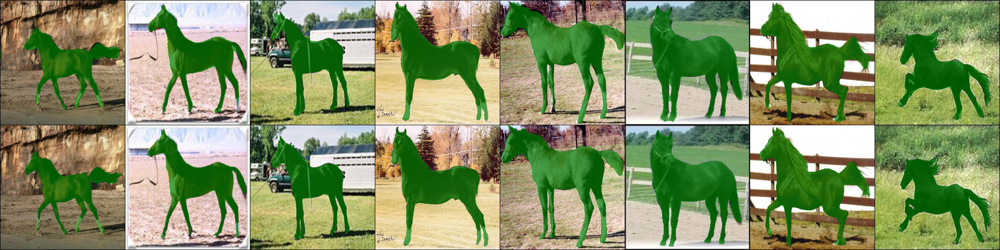

# Two Semantic Segmentation Model

> HUSTAIA 2022 Spring

This repo include two classic semantic segmentation model.

[DenseASPP(Yang et.al. 2018)](https://ieeexplore.ieee.org/document/8578486?arnumber=8578486)

[FastSCNN(Poudel et.al. 2019a)](http://arxiv.org/abs/1902.04502)


The first row is model prediction, and the second row is ground truth.

## Updates
- 2022/8/10: mix percision training supported now

- 2022/8/9: augmentation and acceleration finished

- 2022/8/9: FastSCNN finished

- 2022/8/8: DenseASPP finished 

## Highlights

### DenseASPP
- **denser feature**: DenseASPP can capture denser features in scale dim than normal ASPP
- **more scales**: DenseASPP can capture usable feature under more flexible object scale which is suitable for autonomous driving

### FastSCNN
- **low complexity**: FastSCNN only has a 1.11 million parameters
- **real-time**: FastSCNN can have a pretty high infer speed

model size:
- DenseASPP: 54MB
- FastSCNN: 5MB

## Result
### Training details
DenseASPP：
batch_size:8,epochs:80,init_lr:1e-3,momentum:0.9,weight_decay:1e-4,lr_schduler: x0.1 every 20 epochs,aug_data: false

FastSCNN:
batch_size:8,epochs:80,init_lr:1e-2,momentum:0.9,weight_decay:1e-4,lr_schduler: x0.1 every 20 epochs,aug_data: true,

Training data is from [this kaggle competition](https://www.kaggle.com/datasets/ztaihong/weizmann-horse-database/metadata) data.

train test split ratio: 0.85:0.15
### Evaluation result
Evaluate on 0.15 splited test dataset

|model|pixAcc|mIoU|bIoU|
|-|-|-|-|
|DenseASPP|0.903213|0.909062|0.725130|
|FastSCNN|0.806844|0.802359|0.531219|

The hyperparameter space is not fully searched, so it may be better after more hyperparameter tuning.

## Usage

### Requirement
- pytorch >= 1.13.0

### A quick demo
I have embed the model weight in `asset/model` and several images for demonstration in `asset/demo_data`.

Run the following command for a quick demo of my models.

```bash
python demo.py --model_path='asset/model/FastSCNN_accHorse_best.pth' --model='FastSCNN'

python demo.py --model_path='asset/model/DenseASPP_horse_best.pth' --model='DenseASPP'
```

Demo result figure will be store under `asset` folder

### Data preparation
download the data from  [kaggle competition](https://www.kaggle.com/datasets/ztaihong/weizmann-horse-database/metadata) and put it like this:

```bash
.
├── asset
│   ├── demo_data
│   ├── DenseASPP_demo_result.jpg
│   ├── FastSCNN_demo_result.jpg
│   └── model
├── data
│   ├── accHorse (generate using utils/dataset.py)
│   ├── cityspaces (download from official website)
│   └── horse_data (download from kaggle comp)
├── saved (path to save the log and model during training)
├── demo.py
├── model
│   ├── backbone
│   ├── DenseASPP.py
│   ├── Fast_SCNN.py
│   └── __init__.py
├── README.md
├── test.py
├── train.py
└── utils
    ├── dataset.py
    ├── logger.py
    └── metric.py
```

Accelerate data preprocessing in training: you can have a look at `utils/dataset.py`. The general idea is to save the preprocessed img and mask using batch_size=1 as `idx.pt` format

with batch_size=8
- Before acc: load a batch cost 0.27s 
- After acc: load a batch cost 0.13s

Almost x2 speed up
and this can be further speed up by set num_worker=4 and pin_memory=True in dataloader

### Evaluate
```bash
python test.py --model_path='asset/model/FastSCNN_accHorse_best.pth' --model='FastSCNN'

python test.py --model_path='asset/model/DenseASPP_horse_best.pth' --model='DenseASPP'
```
The result will be printed in the console window

### Train
```bash
python train.py --model='FastSCNN'

python train.py --model='DenseASPP'
```
More adjustable parameters can be found in train.py or using `python train.py --help`

